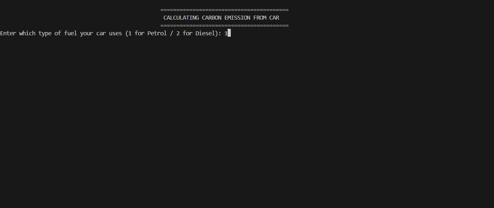
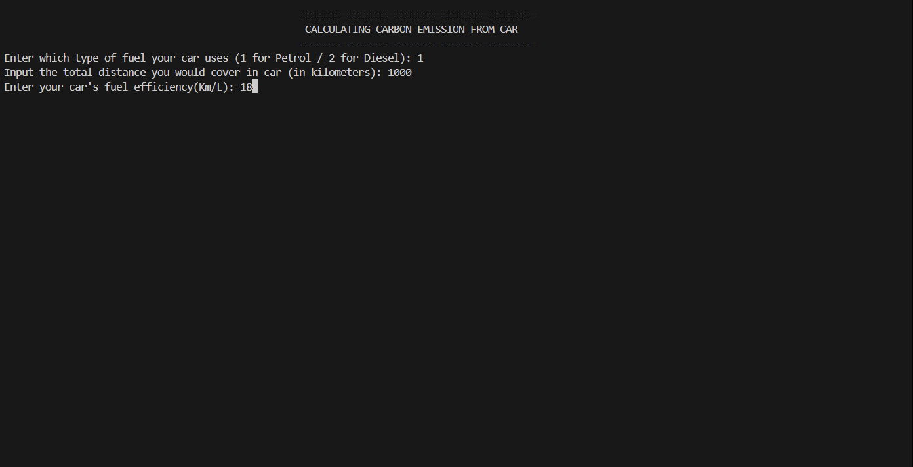
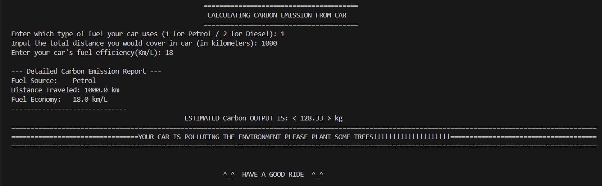

# Carbon Emission from Car Calculator Project 

##  Project Overview
The **Carbon Emission from Car Calculator** is a Python-based command-line project designed to estimate the carbon emission of vehicle travel. By analyzing fuel type (Petrol/Diesel), distance traveled, and fuel efficiency, the tool calculates total Carbon emissions from car using standard stoichiometric factors.

This project is developed by me as part of the **Python Essentials** course evaluation for vityarthi.It demonstrates **Modular Programming** by splitting logic, user interface, and configuration into separate files.

##  Features
- **Modular Architecture:** The codebase is split into 6 specific modules (`logic`, `ui`, `inputs`, etc.) for maintainability and easy reading
- **Dual Fuel Support:** Accurate emission factors for **Petrol** (2.31 kg/L) and **Diesel** (2.68 kg/L).
- **Eco-Feedback System:** Provides immediate feedback (e.g., "Plant some trees!") based on the severity of emissions.
- **Robust Error Handling:** safely manages non-numeric inputs and prevents application crashes.

##  Technologies Used
- **Language:** Python 3.x
- **Libraries:** Standard Python libraries (`sys` for system exit operations).
- **Tools:** GitHub for version control.

##  Project Structure
The source code is organized into a `src` package containing **6 meaningful modules**

```text
Carbon-emission-from-car-calculator-project/
│
|──src/
|  ├── config.py        (Holds your constants/magic numbers)
|  ├── utils.py         (Helper functions for formatting lines)
|  ├── logic.py         (Your calculation math)
|  ├── inputs.py        (Handles user typing)
|  ├── ui.py            (Handles all print statements/banners)
|  └── main.py          (The conductor that runs everything)
│
├── screenshots/
│   ├── output.png        # Main execution result
│   ├── step1.png         # Input demonstration
│   ├── step2.png         # Calculation demonstration
│   └── step3.png         # Error handling demonstration
│
├── README.md             # Project documentation
└── requirements.txt      # libraries used
```
## Steps to Install & Run
1. Clone the repository:
  ``` git clone https://github.com/soham25BCE10463/Carbon-emission-from-car-calculator-project.git```
2. Navigate to the Source Directory:
  ``` cd src```
3. Run the Application:
  ``` python main.py```
## Instructions for Testing
To verify the application works as expected, perform the following test case:
 example 1: Standard Petrol Trip
  -Input: Fuel = 1 (Petrol), Distance = 1000, Mileage = 18
  -Expected Output: Total Emission ~ 128.33 kg. Message: "YOUR CAR IS POLLUTING THE ENVIRONMENT PLEASE PLANT SOME TREES".

  ##  Screenshots
  ***step 1***
  

***step 2***


***step 3***


***final out put***



  ##  Author
  **Name** - SOHAM SUDARSHAN SHINDE
  **REG No** - 25BCE10463
  **Course name** - Python essentials

